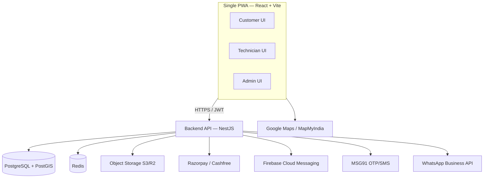

# FixNGo / Homi Services — Tech Stack & Solution

## Solution Overview

One **shared codebase** delivered as an installable **Progressive Web App (PWA)** that
serves both web and mobile (Android/iOS home-screen install). A single backend API serves
three role-based experiences. Role is resolved after login via JWT, so the same app renders
the Customer, Technician, or Admin UI.

- **One application**: installable PWA, runs in any browser, add-to-home-screen on Android/iOS.
- **Native-like features**: push notifications, GPS/location, camera, offline capability.
- **Unified backend**: single API handles auth, business logic, payments, notifications.
- **Future-ready**: same code can be wrapped (Capacitor) into Play Store / App Store apps.

## Architecture



Backend is a **modular monolith** (auth, customers, technicians, jobs, payments,
notifications modules) — cheapest to build/run at early scale (hundreds→few thousand
users), splittable into services later.

## Technology Stack

| Layer | Technology | Purpose |
|---|---|---|
| Frontend (PWA) | React 18 + Vite + `vite-plugin-pwa` (Workbox) | One codebase for web + installable mobile app; offline caching, install prompt |
| UI | Tailwind CSS + shadcn/ui (Radix) | Mobile-first, responsive, accessible |
| State/Data | TanStack Query + Zustand | Server-state caching + lightweight client state |
| Forms/Validation | React Hook Form + Zod | Type-safe validation shared with backend |
| Backend | Node.js + NestJS (TypeScript) | Structured, scalable REST API; modular per role; DI + guards for RBAC |
| Database | PostgreSQL + PostGIS | Relational storage + geospatial queries for technician routing/nearby jobs |
| ORM | Prisma | Type-safe DB access, migrations |
| Cache/Queue | Redis + BullMQ | OTP throttling, notification jobs, route optimization tasks |
| Auth | JWT (access + refresh) + role-based guards | Customer / Technician / Admin separation |
| Payments | Razorpay (primary) / Cashfree | UPI, cards, wallets — India-native |
| Push | Firebase Cloud Messaging | Real-time updates (web push in PWA) |
| SMS/OTP | MSG91 | OTP login + transactional SMS |
| WhatsApp | WhatsApp Business API (Interakt/Gupshup) | Customer status alerts |
| Maps | Google Maps / MapMyIndia | Location, routing, ETA |
| Storage | AWS S3 / Cloudflare R2 | Product images, job photos, documents |
| Hosting | AWS Mumbai / DigitalOcean | Low-latency in India |
| CI/CD & Ops | Docker + GitHub Actions, Sentry, Nginx + Let's Encrypt SSL | Reliable deploys, monitoring |

## Modules & Mapping

**Customer** — registration/profile, service requests, resell old products, live tracking,
ratings → React screens + FCM/WhatsApp alerts + Maps tracking.

**Technician** — accept/reject jobs, real-time status (on-site, in progress, completed),
daily schedule, optimized routes, chat → PostGIS nearest-job queries + Google Directions + FCM.

**Admin** — manage users/technicians/services/commissions, assign jobs, monitor progress,
analytics/reports → NestJS admin module + reporting queries + dashboards.

## Key Architectural Notes

- **Geospatial**: use PostGIS for "nearby technicians" and route filtering, not app-side math.
- **Offline-first**: service worker caches shell + last-known job data for low-connectivity work.
- **Security (OWASP-aware)**: short-lived JWT access tokens + refresh rotation, role guards,
  rate-limited OTP, signed/verified payment webhooks, input validation at the API boundary.
- **Why PWA over native**: one codebase → lower cost, faster delivery, simpler maintenance;
  native-like features supported; wrappable to native later with minimal effort.

## When to Use

- Scaffolding the FixNGo/Homi frontend (React + Vite PWA) or backend (NestJS API).
- Deciding technology for payments, OTP, WhatsApp, maps, push, storage, or hosting.
- Implementing Customer / Technician / Admin role features and RBAC.
- Adding geospatial technician matching/routing or offline support.

## Agent Memory & Promotion

The FixNGo agent keeps its own working memory and promotes durable learnings into
this skill so they become permanent, always-available knowledge.

**Files**
- Working memory store: [memory/entries.json](./memory/entries.json) (schema:
  [memory/entries.schema.json](./memory/entries.schema.json)).
- Promoted, permanent knowledge: [references/verified-knowledge.md](./references/verified-knowledge.md).
- Capture hook script: [scripts/capture-memory.mjs](./scripts/capture-memory.mjs)
  (wired via [.github/hooks/fixngo-memory.json](../../hooks/fixngo-memory.json)).
- Promotion script: [scripts/promote-memory.mjs](./scripts/promote-memory.mjs).

**Automatic capture (every prompt & change)**
Hooks record activity automatically into the working store as unverified entries:
- `UserPromptSubmit` → one entry per user prompt (`source: "prompt"`, category `Prompt`).
- `PostToolUse` → one entry per file change / tool run (`source: "change"`, category `Change`).

Capture is non-blocking and bounded: entries are truncated to `policy.noteMaxChars`,
and auto-captured unverified entries are capped at `policy.maxAutoEntries` (oldest
dropped first). Set `policy.captureEnabled: false` to turn capture off.

**Promotion workflow**
1. Auto-captured prompts/changes land in `memory/entries.json` as `verified: false`.
   You may also hand-write curated entries with `id`, `category`, `note`,
   `verified: false`, and today's `createdAt`.
2. When a learning is confirmed correct, set `verified: true` on that entry.
3. Run promotion. Entries that are **verified AND ≥ 5 days old** are moved into
   `references/verified-knowledge.md` (grouped by `category`) and removed from the
   working store. Unverified or younger entries stay in working memory.

```bash
node scripts/promote-memory.mjs --dry-run   # preview what would be promoted
node scripts/promote-memory.mjs             # apply promotion
```

The 5-day + verified gate keeps unproven notes out of permanent knowledge, so only
learnings that have held up over time graduate into the skill. Raw prompt/change
captures never promote on their own — they must be reviewed and marked `verified`.
Always consult `references/verified-knowledge.md` before making related decisions.

**Dreaming (consolidation to keep memory small)**
Because auto-capture makes the store grow fast, a "dreaming" pass compacts it,
running automatically at session end (`Stop` hook) via
[scripts/dream-memory.mjs](./scripts/dream-memory.mjs):
1. Prune noise (empty / `Unknown` events).
2. Dedupe identical raw notes into a single entry with an `occurrences` count.
3. Consolidate raw entries older than `policy.dream.consolidateAfterDays` into one
   per-(category, day) **digest** (`source: "dream"`), archiving the originals to
   `memory/archive/<YYYY-MM>.jsonl` for auditability.

Dreaming never touches curated entries, `verified` entries, or existing digests, so
it never interferes with promotion. Tune it under `policy.dream`
(`enabled`, `consolidateAfterDays`, `dropNoise`, `maxDigestThemes`, `archive`).

```bash
node scripts/dream-memory.mjs --dry-run   # preview consolidation
node scripts/dream-memory.mjs             # compact the store
```

**Lifecycle:** capture (every prompt/change) → dream (compact into digests) →
verify (mark true) → promote (≥ 5 days → permanent knowledge).

## Quality Gate

Two layers enforce quality after code changes:
- **Deterministic backstop** — the `Stop` hook runs
  [scripts/gate-hook.mjs](./scripts/gate-hook.mjs), which reads the memory change log
  (the `PostToolUse` captures, ignoring `.github/`) to detect code changed since the
  last gate run and, if any, runs the gate and reports the verdict as a system
  message. No git required — it reuses the same change data the agent already records.
- **Reasoning wrapper** — the `child-quality` subagent
  ([.github/agents/child-quality.agent.md](../../agents/child-quality.agent.md))
  runs the same [scripts/quality-check.mjs](./scripts/quality-check.mjs) and returns
  an actionable PASS/FAIL report. The `fixngo` agent is instructed to invoke it after
  any code-generating turn.

The gate covers: (1) code quality (tsc/ESLint/Prettier), (2) vulnerabilities
(`npm audit`), (3) duplication (`jscpd`), (4) memory leaks (leak tests or static
heuristics), (5) security (SAST + secret scan). Missing tools report as SKIP.

```bash
node scripts/quality-check.mjs            # human-readable report
node scripts/quality-check.mjs --json     # machine-readable (used by the hook/subagent)
```
