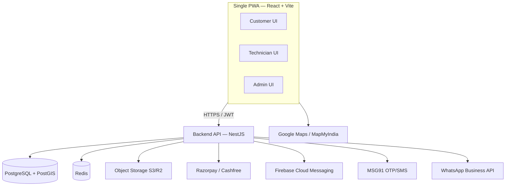

# FixNGo / Homi Services

A single, unified **Progressive Web App (PWA)** serving Web + installable mobile
(Android/iOS) with three role-based experiences — **Customer**, **Technician**, and
**Admin** — from one shared codebase and a single backend API. Target market: India.

## Monorepo layout

```
apps/
  api/   NestJS modular-monolith REST API (auth, customers, technicians, jobs, payments, notifications)
  web/   React + Vite PWA (role-based routing for Customer / Technician / Admin)
```

## Architecture



## Tech stack

| Layer | Tech |
|---|---|
| Frontend | React 18 + Vite + vite-plugin-pwa (Workbox), Tailwind, TanStack Query, Zustand, React Router |
| Backend | NestJS (TypeScript), Prisma, PostgreSQL + PostGIS, Redis |
| Auth | JWT access + refresh, role-based guards |
| Payments | Razorpay / Cashfree (UPI, cards, wallets) |
| Notifications | FCM (push), MSG91 (OTP/SMS), WhatsApp Business API |
| Maps | Google Maps / MapMyIndia |

See the `fixngo-tech-stack` skill for the full blueprint.

## Getting started

```bash
# install all workspaces
npm install --workspaces

# copy env templates (apps/api/.env is pre-filled for local dev)
cp apps/api/.env.example apps/api/.env
cp apps/web/.env.example apps/web/.env

# start Postgres (PostGIS) + Redis
docker compose up -d

# apply the database schema (creates the postgis extension + tables + geo index)
npm --workspace apps/api run prisma:generate
cd apps/api && npx prisma migrate deploy && cd ../..

# run
npm run dev:api    # http://localhost:3000/api
npm run dev:web    # http://localhost:5173
```

> Local login works out of the box: `OTP_DEV_BYPASS=true` in `apps/api/.env`
> accepts any OTP. Set it to `false` and add MSG91 credentials for real OTP.
> Razorpay / WhatsApp / FCM calls no-op with a warning until their env vars are set.

## Quality gate

```bash
npm run quality
```

Runs code quality, vulnerability, duplication, memory-leak, and security checks.